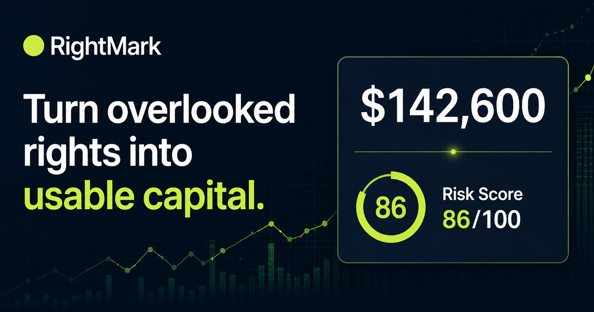

# RightMark

**Public-record fishing quota evaluation, downside modeling, and illustrative financing options in one decision-ready workflow.**

[](https://rightmark-finance.pragnan740.chatgpt.site/)
[](https://github.com/ryansrivastava-dev/rightmark-finance/actions/workflows/ci.yml)
[](https://nodejs.org/)



## Why RightMark

Fishing quota records are public, but turning fragmented holdings, market inputs, and risk assumptions into a useful financial view is difficult. RightMark creates a transparent path from an NMFS ID to:

- a complete matching halibut and sablefish quota-share record;
- species- and area-aware valuation inputs;
- an explainable modeled asset value and stress value;
- borrowing-capacity scenarios and illustrative loan structures;
- a downloadable PDF evaluation report.

RightMark is a prototype for decision support. It does **not** authenticate ownership, issue credit, provide a real loan offer, or replace professional financial, legal, or regulatory advice.

## Product capabilities

| Capability | What it does |
| --- | --- |
| Public record lookup | Aggregates every matching 2026 NOAA holder row for an NMFS ID |
| Evaluation | Converts quota-share records into an explainable modeled value |
| Stress testing | Adjusts allowable catch, price, fuel cost, and regulatory risk |
| Marketplace | Compares three clearly labeled illustrative financing structures |
| PDF reports | Exports the record, assumptions, valuation logic, risk view, and selected option |
| Persistence | Stores analyses, illustrative offers, and completed scenarios in Cloudflare D1 |

## Data sources

RightMark uses public information from:

- [NOAA Fisheries](https://www.fisheries.noaa.gov/) — IFQ holders, landings, quota-share pools, asserted interests, and transfer eligibility;
- [International Pacific Halibut Commission](https://www.iphc.int/) — fishery limits and published price context;
- [U.S. Energy Information Administration](https://www.eia.gov/) — weekly diesel prices.

When a live upstream request is unavailable, the interface identifies that cached public values are being used.

## Architecture

```text
Browser
  └─ React + vinext App Router
       ├─ /api/analyze       Public-record lookup and valuation
       ├─ /api/stress        Scenario modeling
       ├─ /api/offers        Illustrative financing structures
       ├─ /api/report        PDF generation
       └─ Cloudflare D1      Analyses, offers, and scenario records

External sources
  ├─ NOAA Fisheries
  ├─ IPHC
  └─ U.S. EIA
```

The application is built with React 19, TypeScript, vinext, Cloudflare Workers, Drizzle ORM, D1, GSAP, and PDF-Lib.

## Local development

### Prerequisites

- Node.js 22.13 or newer
- pnpm 11

### Setup

```bash
git clone https://github.com/ryansrivastava-dev/rightmark-finance.git
cd rightmark-finance
pnpm install --frozen-lockfile
pnpm dev
```

Open the local URL printed by Vite.

### Streamlit deployment

RightMark also includes a standalone Streamlit entry point for Streamlit Community Cloud:

```bash
python -m pip install -r requirements.txt
streamlit run streamlit_app.py
```

When creating a Streamlit Cloud app, select this repository and set the main file path to
`streamlit_app.py`. An optional `EIA_API_KEY` can be added in Streamlit Secrets; the public demo
key is used when it is not configured.

The EIA public demo key works by default. To use your own EIA key locally:

```bash
cp .dev.vars.example .dev.vars
```

Then replace the placeholder value in `.dev.vars`.

## Commands

| Command | Purpose |
| --- | --- |
| `pnpm dev` | Start the local development server |
| `pnpm build` | Create the production vinext build |
| `pnpm test` | Build and run rendered-output tests |
| `pnpm lint` | Run ESLint |
| `pnpm db:generate` | Generate Drizzle migrations |

## API overview

| Route | Method | Purpose |
| --- | --- | --- |
| `/api/health` | GET | Product and capability status |
| `/api/market-data` | GET | Current public market inputs and source state |
| `/api/analyze` | POST | NMFS record aggregation and evaluation |
| `/api/stress` | POST | Downside scenario calculation |
| `/api/offers` | POST | Illustrative financing comparisons |
| `/api/offers/accept` | POST | Record a simulated selected option |
| `/api/report` | POST | Generate a PDF evaluation |

## Project structure

```text
app/          UI, metadata, and API routes
db/           D1 access and Drizzle schema
drizzle/      Database migrations
lib/          Public-data adapters and financial models
public/       Brand and product assets
tests/        Rendered-output tests
worker/       Cloudflare Worker entry point
```

## Contributing and security

Contributions are welcome. Read [CONTRIBUTING.md](CONTRIBUTING.md) before opening a pull request.

For security-sensitive reports, follow [SECURITY.md](SECURITY.md) and avoid disclosing vulnerabilities in a public issue.

## Live product

[Launch RightMark](https://rightmark-finance.pragnan740.chatgpt.site/)
